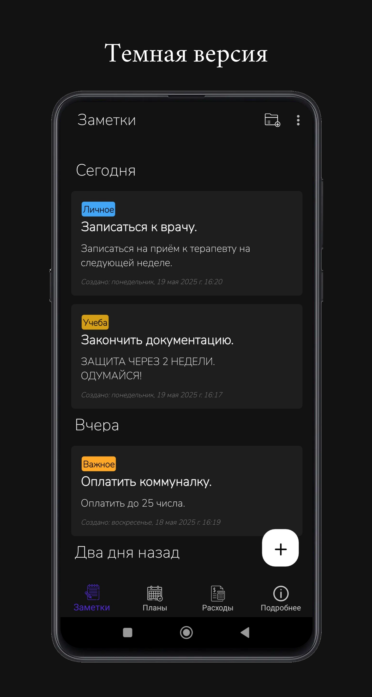

<h1 align="center">
    
     
    <b>Time is Money | Track notes, schedule plans, and manage expenses all in one app.</b>
</h1>

    <a href="#зачем">Зачем?</a>
    •
    <a href="#технологии">Технологии</a>
    •
    <a href="#функциональность">Функциональность</a>
    •
    <a href="#скриншоты">Скриншоты</a>
    •
    <a href="#лицензия">Лицензия</a>

## Зачем?

Этот проект - моя дипломная работа, ставшая прекрасной возможностью попробовать себя в мобильной разработке. С самого начала было решено разрабатывать мобильное приложение (предметная область определилась позже), а то, что мне всегда нравился C#, предопределило выбор .NET MAUI. Это проект стал отличной возможность попробовать себя в мобильной разработке, изучить новый фреймворк и углубить свои знания о .Net в целом.

## Технологии

Этот проект построен с использованием следующих технологий:

*   **Основные:**
    *   Visual Studio - IDE для разработки.
    *   C# - Язык программирования.
    *   .NET MAUI - Кроссплатформенный фреймворк для создания нативных приложений.
    *   SQLite - Локальная реляционная база данных для хранения данных.
    *   DevExpress - Библиотека UI-компонентов для .NET MAUI (укажите конкретные компоненты, если это возможно).

*   **Архитектура:**
    *   MVVM (Model-View-ViewModel) - Архитектурный паттерн для разделения UI и бизнес-логики:
        *   `Model`: Представляет данные и бизнес-логику.
        *   `View`: Отвечает за отображение данных и взаимодействие с пользователем.
        *   `ViewModel`: Предоставляет данные для View и обрабатывает пользовательские действия.

*   **Платформа:**
    *   Android - Целевая платформа.
 
## Функциональность

### Общее

*   Интуитивно понятный пользовательский интерфейс.
*   Адаптивная темная/светлая тема.
*   Локальное хранение данных.

### Заметки

*   **Создание и редактирование:**
    *   Создание новых заметок с текстом.
    *   Редактирование существующих заметок.
*   **Категории заметок:**
    *   Создание и управление категориями для заметок.
    *   Назначение категорий заметкам.
*   **Фильтрация и поиск:**
    *   Фильтрация заметок по категориям.
*   **Группировка:**
    *   Группировка заметок по временным отрезкам.

### Планы

*   **Создание и редактирование планов:**
    *   Создание планов.
    *   Редактирование существующих планов.
*   **Группировка:**
    *   Группировка планов по временным отрезкам.
*   **Календарь:**
    *   Отображение планов на календаре.
    *   Фильтрация планов по выбранной дате в календаре.
*   **Уведомления:**
    *   Уведомления за час до назначенного времени плана.
    *   Уведомления о наступлении времени плана.

### Расходы

*   **Создание и редактирование расходов:**
    *   Создание расходов с указанием суммы, категории и описания.
    *   Редактирование существующих расходов.
*   **Категории расходов:**
    *   Создание и управление категориями для расходов.
    *   Назначение категорий расходам.
*   **Фильтрация и календарь:**
    *   Фильтрация расходов по категориям.
    *   Фильтрация расходов по датам через календарь.
*   **Диаграмма расходов:**
    *   Отображение общей диаграммы расходов.
    *   Диаграмма, показывающая распределение трат по суммам.
    *   Диаграмма, показывающая распределение трат по категориям.

### Настройки

*   **Тема:**
    *   Выбор светлой темы.
    *   Выбор темной темы.
    *   Использование системной темы устройства.

### Хранение данных

*   Все данные хранятся локально на устройстве в базе данных SQLite.

## Скриншоты

### Здесь представлены скриншоты различных экранов приложения

    
Заметки

 
    

      
      
      
    

    

      
      
    

  

    
Планы

    
Расходы

    
О приложении

## Лицензия

Time is Money распространяется на условиях лицензии Apache (версия 2.0). Подробности в [Лицензия](LICENSE.txt).
